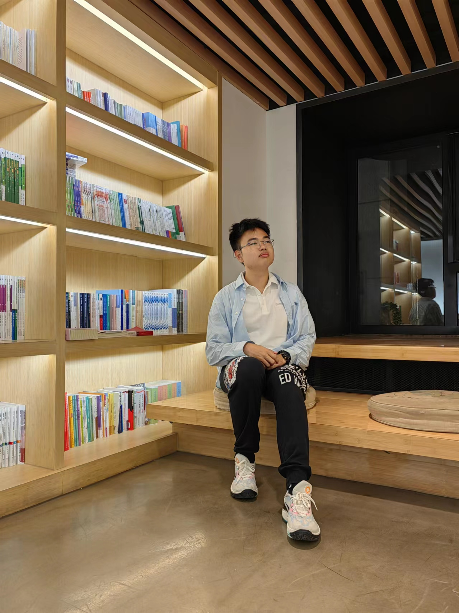

# [CalvinXiaocao.github.io](https://calvinxiaocao.github.io)

> **Nice to meet you! 😄**

## 个人简介
### 曹彧
**北京大学信息科学技术学院 本科生**

  

    
我来自吉林长春，目前在北京大学信息科学技术学院学习计算机基础和人工智能。我喜欢编程，尤其爱探究代码背后的逻辑，并将自己的所学运用在日常生活当中。同时我也热爱音乐，喜欢唱歌、弹琴，偶尔也会自己作曲。我特别愿意帮助别人，希望将来能够发挥自己的专长，探索人工智能的奥秘，投身于自己热爱的事业当中。

`教育经历`
* 2023- 北京大学信息科学技术学院 本科生
* 2020-2023 东北师范大学附属中学 高中
* 2017-2020 东北师大附中明珠学校 初中
* 2011-2017 东北师范大学附属小学繁荣校区 小学

`奖励荣誉`

* 2023 北京大学新生奖学金 三等奖
* 2023 北京大学英语演讲比赛选拔赛 三等奖
* 2020-2023 高中阶段多次获得三好学生、陶然成长奖等荣誉
  

  

  

  

    

  

> **Public** Page: click [***HERE***](/public)
