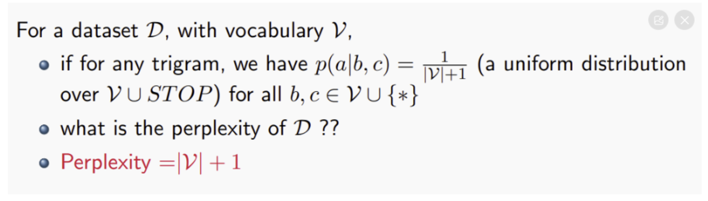

# Lecture 4 - Language Model
Fundamentals of Natural Language Processing, 2025 Spring

?> 本课程笔记整理自Freefizing & 草鱼。

!> **重点内容：** Language Model的概念; unigram, bigram, trigram; 混淆度（Perplexity）的计算；基于神经网络的语言模型；FNN, CNN, RNN。

给定一串英语单词，我们如何判断这串表达是好的还是坏的?

词汇分析？语法分析？句法分析？

但是我们的期望却是：依赖**数据**进行打分

假设我们有一个词汇表 \(\vartheta\) ，由这些不重复的单词可以随机组合成一个接近无穷的句子集合 \(S\) ，每个句子是 \(s\) ，那么如果想判别每个句子它真正出现在人类语言中的概率，也就是给每个句子打分 \(p\) ，我们希望越“好”的句子分数越高，反之越低。

?> 本质上，语言模型**就是在对语言的概率分布进行建模**。如果一句话出现的概率高，那它就是“好”的，否则就是“坏”的，不符合日常说话的习惯。

凭直觉，我们会设计 \(p(s)=\frac{count(s)}{\left| S \right|}\) 其中count是我们在总集合中对 \(s\) 的计数。

但仔细想想漏洞百出：首先我们不知道 \(S\) 里到底有多少句话，其次， \(s\) 可能有多种形式出现（比如包含在别的句子里），我们根本没有办法穷尽对它们的计数。

换种角度：既然句子是一系列词组成的序列而非集合（set具有无序性），那么我们可以尝试计算 \(P(X_{1}=w_{1},X_{2}=w_{2},...,X_{n}=STOP)\)

好处就是：
1. \(X_1, X_2, \dots, X_n\) 每个地方都需要特定的单词，确定了一个序列而非集合！
2. 有了 STOP 和 START 这种标识符，我们可以框定序列出现的情形：单独出现，作为结尾，作为开头。从而忽略掉不符合我们要求的出现方式。
   
只是还有个问题：根据链式法则，
$$
P(X_{1}=w_{1},X_{2}=w_{2},...,X_{n}=STOP)=P(X_{1}=w_{1})\prod_{i=2}^{n}P(X_{i}=w_{i}|X_{1}=w_{1},...,X_{i-1}=w_{i-1})
$$
当 n 非常大时，这个式子的“历史”部分会变得特别长。其实在很多情况下，是不必要有那么长的历史的（比如“吃得好”，前面可以搭配任何人和地点和时间，其实并不影响这三个字的意思）。

此时，我们需要做一点假设来决定历史的长度。

## N-Gram Model

* 0历史——unigram：No history assumption，几乎每个词都是独立出现的，不互相影响。$$P(X_{1}=w_{1},X_{2}=w_{2},...,X_{n}=STOP) =P(X_{1}=w_{1})P(X_{2}=w_{2})P(X_3=w_{3}).....P(X_{n}=STOP)$$
* 1历史——bigram：1st-order Markov assumption，每个词只与它前面的1个词有关。
* 2历史——Trigram：2nd-order Markov assumption，每个词只与它前面的2个词有关。

注意：p(the) 可以看成是 p(the | start, start)，p(cat | the) 可以看成是 p(cat | the, start)

下面要做的是估计参数量：

要计算的参数核心：在 bigram 里，\(p(w_i|w_{i-1})\)；trigram 里，\(p(w_i|w_{i-1},w_{i-2})\) 。

$$
p(w_i|w_{i-1})=\frac{count(w_{i-1},w_i)}{count(w_{i-1})}, p(w_i|w_{i-1},w_{i-2})=\frac{count(w_{i-2},w_{i-1},w_i)}{count(w_{i-2},w_{i-1})}
$$

所以我们的模型究竟有多大呢？

图中的words是篇章中的单词数，并不是词汇表大小。可以看出，unigram的参数量就是词汇表的大小716706，那为什么bigram LM不是预期中的716706的平方值之多呢？因为稀疏度。只有1/4000000左右的参数非零。

## 模型的评估 - Perplexity

语言模型就是个建模自然语言的概率模型，它的任务是评估一个给定的词序列(即一个句子)在真实世界中出现的概率。所以语言模型不单单是用于文本生成，还可以用来做语言评估之类的。

接下来的问题是，我们如何对我们模型的效果进行评估呢？

已知测试语料集 \(S\)，我们的语言模型做的工作是给每个序列出现的可能性打分 \(p(s)=p(w_1,w_{2},...w_n)\) , s是 \(S\)中一个序列，n是s中的单词数，w是具体的单词。

设 \(S\) 中一共有M个单词（ \(\neq\) 词汇表大小），那么对整个数据集来说，我们想知道一个序列token在 \(S\) 中出现的所有地方的打分的积 \(\prod_{s\epsilon S}^{}p(s)\) 作为模型会生成这个token的概率打分，对于总词数 $M$ 进行 normalize 去掉语料长度的影响，再进行 $\log$，将概率值转化为一种“惩罚”，对数函数将大于1的值映射到正数，将小于1的值映射到负数，可以得到 \(\frac{1}{M}\sum_{s\epsilon S}^{}{\log p(s)}\) , 加个负号，再放在指数上进行放大，就可以得到指标——混淆度计算公式。

**混淆度（歧义度）概念：** $$Perplexity(S)=2^{-\frac{1}{M}\sum_{s\epsilon S}{\log p(s)}}$$

衡量一个语言模型在未见过的的语料 \(S\) 上的表现，取值范围 \((1, +\inf)\)，这个句子越好，里面的s序列的打分$p(s)$当然就越高 $\to$1，$\log p(s)$ 就越接近0，指数越接近0，混淆度越低，接近1。

看一个例子：

分析：每个单词出现的概率都是均匀的一个模型，最终 perplexity 是所有单词的 $p(a \mid b, c)$ 乘积，那么最终p的连乘结果是 $(\frac{1}{\left| V \right|+1})^M$，经过以上处理，得到 perplexity 即为 $\left| V \right|+1$。因此，$V$ 越大，意味着 perplexity 越大，这段语言就越不好（没有辨识度），或者也意味着模型在面对自然语言的时候能力一般。

---

## 平滑

在训练过程中，如果某些事件没有出现过，MLE可能会给这些事件分配零概率，导致模型在预测时无法正确识别这些事件。

为了解决unseen的问题，可以考虑以下几种方法：
1. **back-off**：使用更简单的模型(更短的历史)来处理 unseen，可能会得到更合理的估计。
2. **生成伪词 UNKNOWN**：为未见事件创建一个特殊的类别或标签，例如 “**UNKNOWN**”，以便模型能够识别并处理这些事件。
3. **平滑原始估计**：对原始的估计结果进行平滑处理，以减少对未见事件的零概率估计，从而提高模型的泛化能力。

**平滑（Smoothing）：适用于V非常大的情况，能够有效的稀释 unseen 分配的概率。**

**基本思想**：对计数进行调整，将一部分概率质量从已见事件转移到未见事件上。

### Laplace (加一) 平滑

对每个 n-gram 的计数加一，即将零计数变为1，已见计数由 c 变为 c+1。

- 对于 unigram:
  $$
  P_{\text{Laplace}}(w_i) = \frac{c(w_i) + 1}{N + V}
  $$

- 对于 bigram:
  $$
  P_{\text{Laplace}}(w_n | w_{n-1}) = \frac{C(w_{n-1}w_n) + 1}{C(w_{n-1}) + V}
  $$

其中 \(V\) 为词汇表大小。

### 局限性

此方法简单直观，但往往会过度转移概率质量，导致已见事件的概率被显著降低，从而影响模型性能。

---

## 插值（Interpolation）

### 基本思想

当高阶 n-gram 的计数不足时，可以利用低阶 n-gram（如 unigram、 bigram）的信息对其进行补充。插值方法通过线性组合不同阶数 n-gram 的概率，平滑地整合上下文信息，从而提高对未见事件的估计。 
简单线性插值：对于 trigram 模型，利用 unigram、bigram 和 trigram 的概率进行组合，其形式为：

如何确定 $\lambda$ 的值？

---

### 上下文插值

为使插值更灵活，可令各个 \(\lambda\) 权重依赖于上下文，即：

\[
P(w_n | w_{n-2}w_{n-1}) = \lambda_1(w_{n-2}, w_{n-1}) P(w_n) + \lambda_2(w_{n-2}, w_{n-1}) P(w_n | w_{n-1}) + \lambda_3(w_{n-2}, w_{n-1}) P(w_n | w_{n-2}w_{n-1})
\]

**权重学习**

简单插值和上下文插值的权重 \(\lambda\) 通过在独立的保留语料（held-out corpus）上最大化似然函数来学习，使更可靠的 n-gram 拥有更高的权重。

---

## 回退 (Back-off)

**基本思想**

当高阶 n-gram（例如 trigram）无法获得可靠统计时（例如计数为零），直接回退到低阶模型（例如 bigram），并乘以固定的衰减因子，以实现一种简单高效的概率估计。

**Stupid Backoff 算法**

- 如果某个 n-gram 的计数大于零，则使用其 MLE（最大似然估计）估计；
- 否则，将概率设置为较低阶模型概率乘以一个固定的衰减因子 \(\lambda\)（例如 0.4），递归回退至 unigram。

Stupid Backoff 不试图形成一个完整的概率分布，其主要目的是作为一个简单、计算高效的启发式方法来处理稀疏性问题，\(\lambda\) 通常为 0.4。

公式表示：

$$
S(w_i | w_{i-N+1:i-1}) = 
\begin{cases} 
\frac{\text{count}(w_{i-N+1:i})}{\text{count}(w_{i-N+1:i-1})} & \text{if } \text{count}(w_{i-N+1:i}) > 0 \\
\lambda \cdot S(w_i | w_{i-N+2:i-1}) & \text{otherwise}
\end{cases}
$$

---

## Good-Turing折扣法

**Good Turing Discounting 的解释**
在测试过程中，我们可能会看到在训练集中出现r次的单词。我们可以通过从训练集中随机删除单词来构建一个新的但伪训练集：

---

## 总结：N-Gram 模型
### 优点（Pros）

- **易于构建**：N-gram模型可以在数十亿个单词上轻松构建，因为它们只需要统计词序列的频率。
- **平滑处理**：平滑技术（如拉普拉斯平滑）有助于模型泛化到新的数据，特别是对于未见过的词序列。
- **概率评分**：N-gram模型提供的概率评分适用于许多下游任务，如语言模型评估、机器翻译等。
- **同义词处理**：虽然N-gram模型本身不直接处理同义词，但可以通过一些技术（如词干提取）间接处理同义词问题。

### 缺点（Cons）

- **只能捕捉短距离上下文**：N-gram模型通常只能捕捉到固定长度的上下文信息（如二元组、三元组），这限制了它们对长距离依赖的理解。
- **稀疏性**：在大规模词汇表中，许多N-gram组合可能在训练数据中从未出现过，导致数据稀疏问题。
- **存储需求**：由于需要存储大量的N-gram频率和概率，N-gram模型可能需要大量的存储空间。
- **速度**：在处理大量数据时，N-gram模型可能需要较长的计算时间，尤其是在构建和查询模型时。

---

## Neural Language Models
一个基本的单元：
$$
z = \sum_i w_i x_i + b
$$

* $x_i$ 是输入的特征
* $w_i$ 是权重
* $b$ 是偏置
* $z$ 是输出
* 这是一个线性模型

同时我们在线性模型中加入非线性成分

* Sigmoid $$y = \frac{1}{1+e^{-z}}$$
* Tanh $$y = \frac{e^z-e^{-z}}{e^z+e^{-z}}$$
* ReLU $$y = max(0,z)$$

现在我们可以基于这些小 block 搭建我们的神经网络了。

---

### NLM Version 1 - FNN
使用 Feed-Forward Neural Network。

linear, non-linear, linear, non-linear

$$
p(w_i|w_{i-1},w_{i-2},...,w_1) = softmax(b_{out} + \sum_{j=1}^{n-1}w_jA_{j} + W \tanh (u + \sum_{j=1}^{n-1}w_jT_{j}))
$$

* parameters: $b, A, W, T, u$
* vocabulary size: $V$, hidden size: $H$

> $w_j$ 是第j个词的bag-of-words 或者 one-hot 表示。可是 $w_j$ 太稀疏了，我们可以用embedding来表示。具体而言，找到一个 $M$ of $(V, d)$, 使得 $w_i^T M = m_i$，其中 $m_i$ 是 $w_i$ 的 embedding, 长度为 $d$。

$$
p(w_i|w_{i-1},w_{i-2},...,w_1) = softmax(b_{out} + \sum_{j=1}^{n-1} m_jA_{j} + W \tanh (u + \sum_{j=1}^{n-1}m_jT_{j}))
$$

$b(V ), A(d, V), W(V,H), T(d,H), u(H), M(V, d)$

?> 这是 2003 年提出的模型 [Bengio et al., 2003]。可为什么当时没有那么多人关注呢？因为它太慢了……计算量实在大，参数量太多了。可是再仔细想想…… $\sum_{j=1}^{n-1}w_jA_{j}$ 到底有必要吗？尽管可能有一点点效果的提升，但是这个提升是不是值得这么大的计算量呢？

?> 它本质上还是一个 N-gram LM, 但为什么进步了呢？一点是多层可以使特征混合更多样，同时最关键的一点是它把词的表示也当成了参数，一起去训练了。

**Characterizing Sequences**

一个典型的问题是，前馈神经网络强制把位置信息与结果强相关了。比如，它可能无法分清 big blue ball 和 blue big ball。

---

### NLM Version 2 - Convolution
我们引入卷积层。

$$
\mathbf{X}^{(1)} [k, m] = f(b_k + \sum_{i=1}^{d} \sum_{j=1}^{m} C^{(k)}[i, j] \cdot \mathbf{X}^{(0)}[i, m + j - 1] ) 
$$

其中，$f$ 是个非线性激活函数，$w$ 是滑动窗口的宽度，$m$ 是在历史中词汇的位置。$X^{(l)}[∗,m]$ 可以看作是 Hidden state。

最后的一层：引入 pooling 池化层。把 $\mathbf{X^{(D)}}$ 通过 pooling 做成一个向量。可以使用 max pooling 或者 average pooling。

能否更好对历史进行建模？

### NLM Version 3 - Recurrent Neural Network
希望能够用 Hidden State 记录历史状态。具体而言，在 word $w_i$ 处用一个定长的向量 $s_{i-1}$ 来记录历史 $h_{1:i-1}$。

$$
s_0 = 0
$$

$$
s_i = \delta (m_{w_i} W_w + s_{i - 1} W_s + b)
$$

$$
p(w_{i+1}^* | h_{1:i}) = softmax(s_i W_p)
$$

?> 问题？太慢了……中间向量也可能过载；梯度可能会消失，前面的参数很难再更新

---

**Long Short Term Memory (LSTM)**

**Gated Recurrent Units (GRU)**

[**Illustrated Guide to LSTM’s and GRU’s: A step by step explanation**](https://medium.com/data-science/illustrated-guide-to-lstms-and-gru-s-a-step-by-step-explanation-44e9eb85bf21)

## Addition: From Word Representation to Contextual Representations

应用上下文表示

?> `Point of view` Bert 不能严格算作是语言模型，更多是一个 Pretrained Model。
