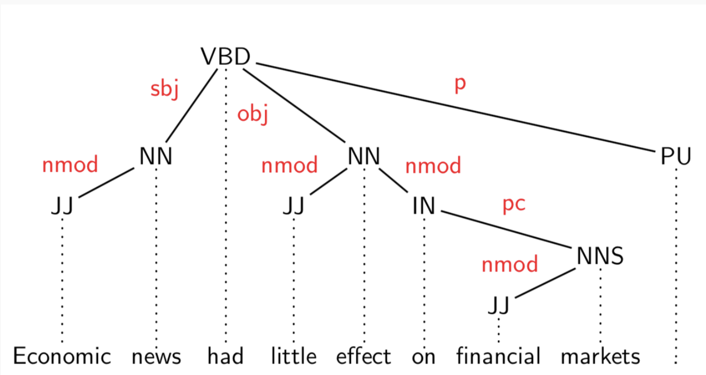

# Lecture 8 - Syntactic Analysis II
Fundamentals of Natural Language Processing, 2025 Spring

?> 本课程笔记整理自Freefizing & 草鱼。

!> **重点内容：** 依存文法、依存图


现在我们来考虑 **dependency structures** 有依赖的结构。

## Dependency Structures 依存结构
- **句子**: *Economic news had little effect on financial markets.*
  
### 依存结构概述:
- **Root**: "had"  
  - **Subj (主语)**: "news"
  - **Nmod (名词修饰语)**: "Economic"
  - **Obj (宾语)**: "effect"
  - **Nmod (名词修饰语)**: "little"
  - **Nmod (名词修饰语)**: "financial"
  - **Nmod (名词修饰语)**: "markets"
  - **PC (介词补语)**: "on"
  - **Punc (标点符号)**: "."


### 依存语法术语

- **Superior (头/主导词)**: 作为主导的词，支配其他词。Head
- **Inferior (依赖/修饰词)**: 依赖于主导词的词。Dependent
- **Dependency Relations (依存关系)**: 表示词语之间的语法关系。

**句法关系的标准:**
1. **Head (H)** 决定构造 **Construction (C)** 的句法类别；**H** 可以替代 **C**。
2. **Head (H)** 决定 **C** 的语义类别；**D** 指定 **H**。
3. **H** 是强制性的；**D** 可以是可选的。
4. **H** 选择 **D** 并决定 **D** 是否是强制性的。
5. **D** 的形式取决于 **H**（配合或支配关系）。
6. **D** 的线性位置是相对于 **H** 来确定的。

---

于是，上面的结构可以建构成树形：



但是，一定是树形嘛？未必。很多情况下，句子的依赖关系可以构成**图**。

## Dependency Graph 依存图

依存结构可以定义为一个有向图，由以下几部分组成：
- **节点集**（Nodes）
- **弧集**（Arcs/Edges）
- **线性顺序**（Linear precedence order）——在节点集上的顺序

**标注图：**
- **节点**：标注为词形（和注释）
- **弧**：标注为依存类型


依存图的性质：
- $G$ 是弱连通的：$(\forall i, j)(i \to j \text{ or } j \to i)$
- $G$ 无环
- $G$ 有单头限制：每个节点只能有一条入边。
- 投影性

### Projectivity 投影性
依存图的 **Projectivity**（投影性）是指依存图的一种结构特性，表示在图中某些依存关系是否符合“投影”的条件。

简单来说：
- 投影性意味着图中的依存关系不应交叉。具体地，如果词 A 依赖于词 B ，且词 C 依赖于词 D ，那么它们的依存关系应该保持一致，不应产生交叉。

$$
\text{if } w_i \to w_j, \text{then } w_i \to \dots \to w_k, \forall w_k \text{ between } w_i,  w_j
$$

---

### Dependency Structures v.s. Phrase Structures

回顾一下 Phrase Structure。


**依存结构 (Dependency Structures)**
- **显式表示**： 
  - 头-依赖关系（有向弧）
  - 功能类别（弧标签）
  - 可能包括一些结构类别（词性）

- **特点**：
  - 依存结构更接近语义（表示词与词之间的直接关系）。
  - 对词序变化更为容忍，语言的顺序不那么重要。
  - 适合用于表示语言中单词间的依赖关系。

**短语结构 (Phrase Structures)**
- **显式表示**：
  - 短语（非终结节点）
  - 结构类别（非终结标签）
  - 可能包括一些功能类别（语法功能）

- **特点**：
  - 短语结构更注重句法层次和语法规则。
  - 以树状结构为基础，强调各个短语的组成。
  - 适合用于描述句子的层级结构和组成部分。
  
---

## Dependency Parsing
给定一句话，我们应该如何去对句子里的关系做解析呢？

### Linguistic Structure Predictions

- **单词**: 单一分类问题
- **单词序列**: 线性链分类问题
- **树、图等**: 搜索一个包含多个分类的结构

**结构化预测的两种视角**

1. **离散优化** (Discrete Optimization)
   - **定义评分函数**并寻求具有最高评分的结构。
   - **算法**：
     - **Viterbi算法**（用于寻找最优路径）
     - **CKY算法**（用于解析上下文无关文法）
2. **增量搜索** (Incremental Search)
   - **搜索状态**：当前已构建的部分结构。
   - **每个动作**：逐步扩展结构。
   - **常用方法**：
     - **贪婪搜索**：每个状态下，分类器决定采取什么行动。
     - **有时通过束搜索**（Beam Search）来改进搜索过程。

$$
y^*(x;\theta)=\argmax_{y\in Y(x)}Score(x, y)
$$

---

### Transition-based Dependency Parsing

**1. 基本概念**

**依赖解析**：分析句子中词语之间的语法依存关系，形成依存树。

**基于转移的解析**：通过一系列动作（transitions）逐步构建依存树。

**2. 转移系统定义**

一个转移系统 S 由四元组 $S=(C, T, c_s, C_t)$ 组成：
- **C**：配置集合（configurations），表示解析器的状态
- **T**：转移操作集合（transitions/parsing actions）
- **$c_s$**：初始化函数，将句子 x 映射到初始配置
- **$C_t$**：终止配置集合（Ct ⊆ C）

**3. 确定性解析算法**

```python
Parse(x = (w0, w1, ..., wn)):
1  c ← cs(x)            # 初始化配置
2  while c ∉ Ct:        # 未到达终止状态
3      t ← GetTransition(c)  # 预测下一个动作
4      c ← Act(c, t)    # 执行动作
5  return Gc            # 返回依存图
```

**4. oracle**

`oracle` 是一个函数 $o: C \to T$。Oracles 是可以用一个分类器来做拟合的。

$$
o(c) = \argmax_{t} ScoreTransition(c, t;\theta)
$$

---

### The Arc-Standard Transition Algorithm

**Stack-based transition systems**
我们用一个 Stack 和一个 Buffer 来完成这个图的建构问题。

```text
+-----------+      +------------+
|   Stack   ->    <-   Buffer   |
+-----------+      +------------+

Results: {}
```

!> PPT 里说后面的可以是个队列，其实感觉更像是一个“反过来的栈”。

**第一步**：把 **ROOT** 放到栈里面，整个句子放到 Buffer 里面。


**第二步**：随后循环执行下面的三种操作：哪种可以执行就执行哪个。直到栈里剩 **ROOT**，Buffer 里为空。

- 如果 `stack.head()` <- `buffer.head()`，能形成 left arc。图中加入对应边，然后执行 `stack.pop()`
- 如果 `stack.head()` -> `buffer.head()`，能形成 right arc。图中加入对应的边，然后注意：执行 `buffer.pop()`，然后将 `stack.head()` 移到 `buffer.head()` (**right shift**)
- 否则两种情况都不满足，就做 **left shift**，也就是将 `buffer.head()` 移到 `stack.head()`


另一种算法：**Graph-Based Dependency Parsing**。在图里找到最大的 spanning tree 伸展树。


### Evaluation
依存分析的评价指标：

1. 无标签标注准确率 UAS (Unlabeled Attachment Score)，定义为被分析器正确找到其中心词的所有词的数量占整个句子词数的百分比

2. 有标签标注准确率 LAS (Labeled attachment Score)，除了找到正确的中心词，同时分析器还必须正确给出该词与中心词之间的关系类型标签
