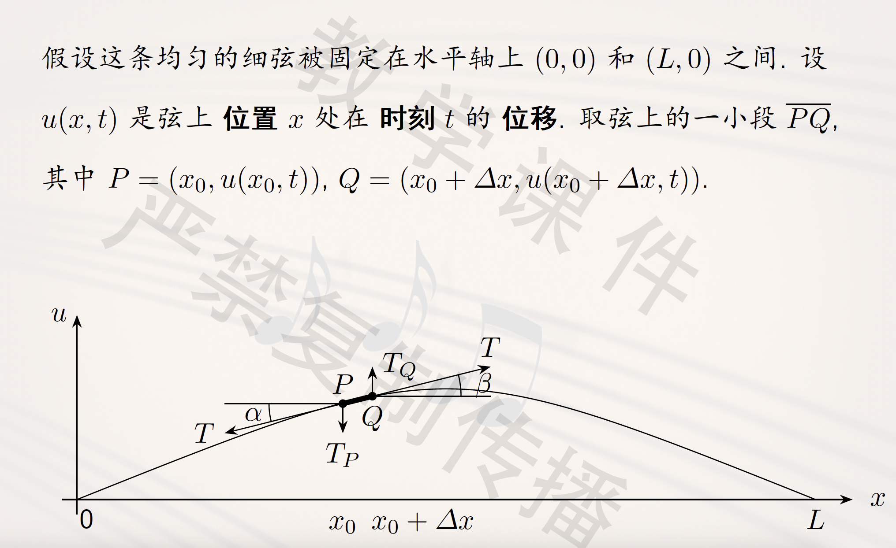
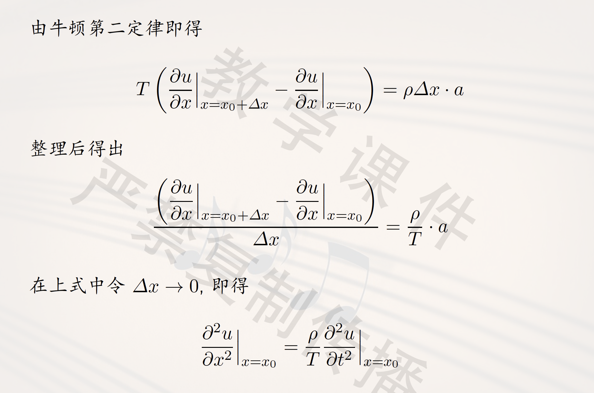
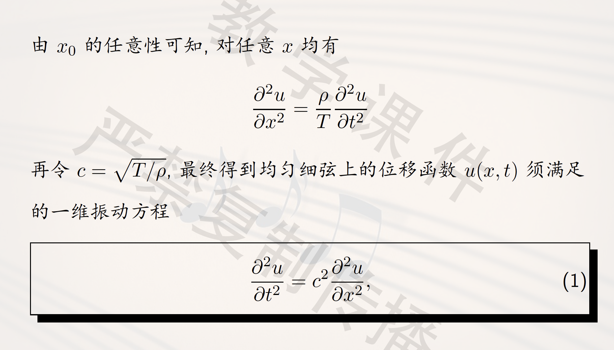
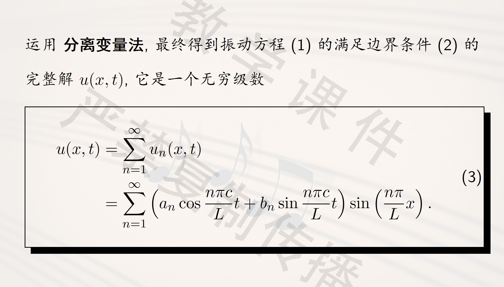
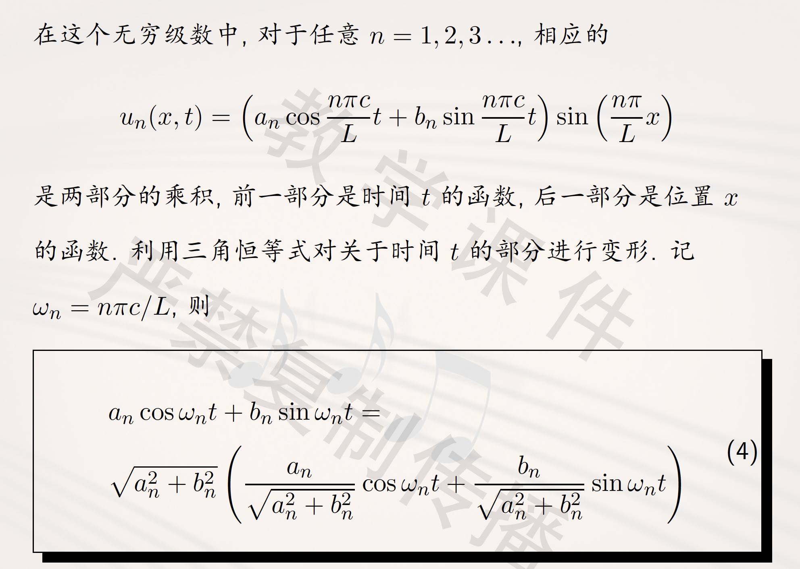
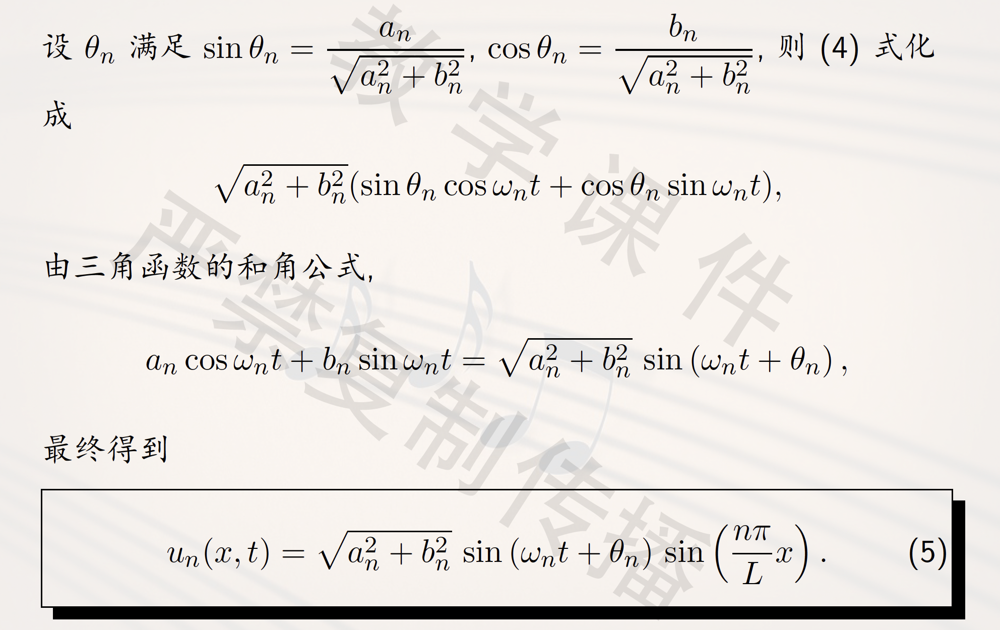
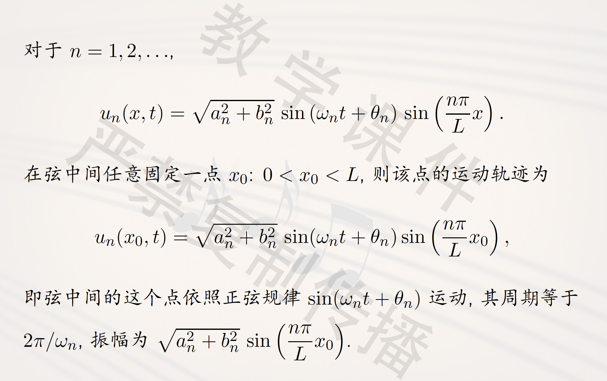
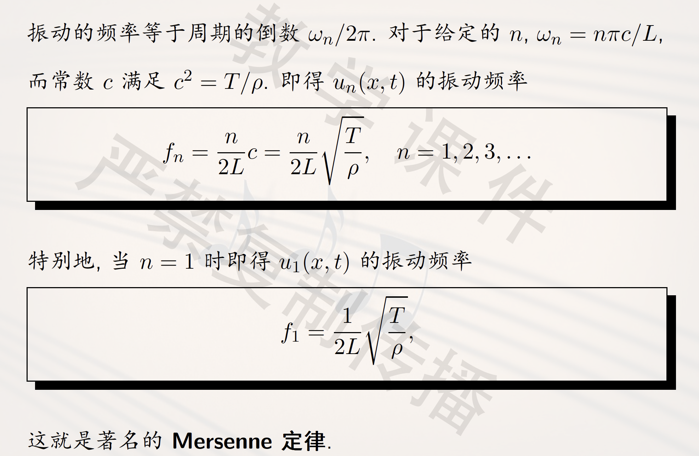
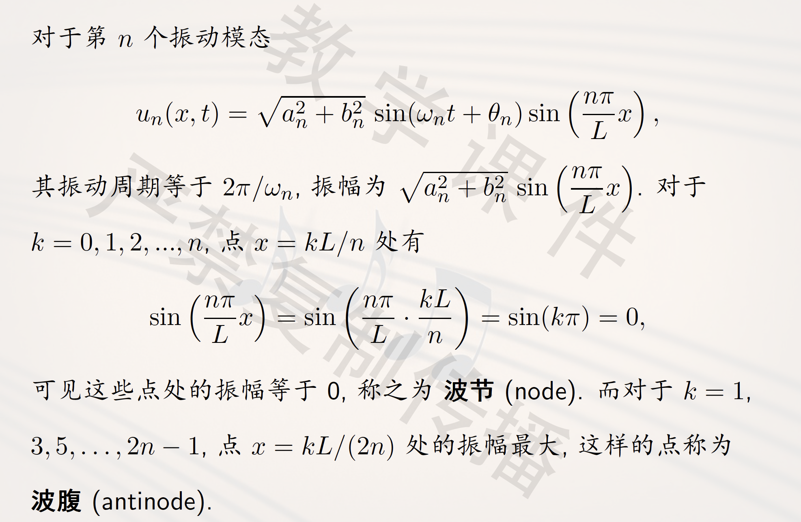
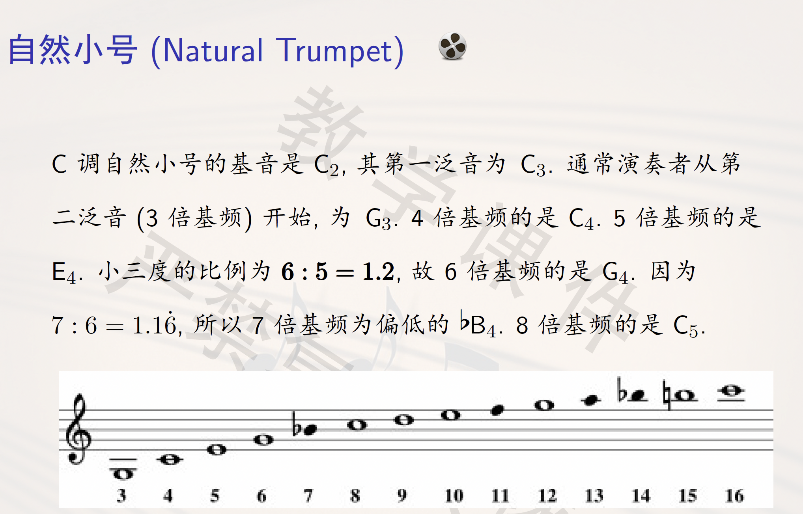

# 一维震动方程
Music In Math, 2025 Spring

## One-Dimensional Wave Equation

### 乐音的分解
一件乐器发出的乐音并不是单一音高的，而是包含了许多不同音高的声音，这些不同频率、不同强度的声音构成了这种乐器独特的音色。

按照震动体分类：气鸣乐器（边棱、唇鸣、簧鸣）、弦鸣乐器（弓弦、弹拨、击打）、膜鸣乐器（鼓、kazoo）、电鸣乐器、体鸣乐器。

### 抽象化
* 一个假设：给定**均匀细弦**
* 三个参数：长度$L$，张力$T$，线密度$\rho$

?> **线密度**：单位长度的质量。

?> **牛顿第二定律**：$F=ma$

弦受到的张力为$T$ ，其线密度（单位长度的质量）为$\rho$ . 因此 $PQ$ 受到的力 $F=T_Q -T_P \approx T（\tan \beta-\tan \beta）$， 质量 $m= \rho \Delta x$.

### 一维震动方程

同时必须满足边值条件：

$$
u(0, t) = u(L, t) = 0
$$

`即使是一根弦，它的震动也是无限震动的叠加。`

把$\sin$和$\cos$统一到一起做化简，得到：

## 震动模态与泛音
### 震动模态
弦的振动并非简单的单一频率运动，而是无穷多个正弦振动的叠加。

$$
u_n(x,t) = \sqrt{a_n^2 + b_n^2}  \sin (\omega_n t + \theta_n) \sin \left( \frac{n \pi x}{L} \right) 
$$

称为第n个震动模态。

$$
\omega_n = \frac{n \pi c}{L}
$$

$$
f_n = \frac{n}{2L} \sqrt{\frac{T}{\rho}}, n = 1, 2, 3, \cdots
$$

?> Intuition: 频率和长度成反比，和张力的平方根成正比，和线密度的平方根成反比。

### 泛音
弦的振动频率组成的序列称为弦的固有频率。$f_1$ 称为基频，对应的音称为基音。$f_2, f_3, \cdots$ 对应的音称为泛音。特别的，$f_2$ 称为第一泛音，$f_3$ 称为第二泛音，以此类推。

记基频$f_1=f$，则固有频率的序列为：$f, 2f, 3f, \cdots$ 音乐上把其称为泛音列。

### 波节与波腹

### 赫尔姆霍兹的饿协和音程泛音列重合理论
八度音程：
$$f, 2f, 3f, 4f,\cdots$$

$$2f, 4f, 6f, 8f,\cdots$$

纯五度音程：
$$f, 2f, 3f, 4f,\cdots$$

$$\frac{3}{2}f, 3f, \frac{9}{2}f, 6f,\cdots$$

大二度音程就不和谐了，因为两个的重合度不高

