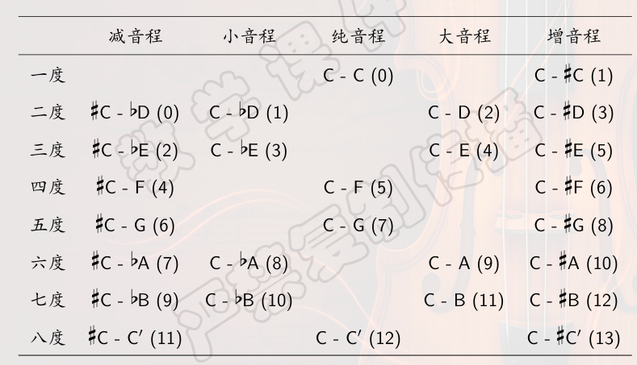

# Chapter 1 音乐基础知识
Music And Math, 2025 Spring

## 1.1 声音
声音是音乐的载体。声音由振动产生，声波是纵波。

声音的物理属性：**音高**（由振动频率决定），**力度**（由空气压力决定），
**时值**（持续长度），**音色**（由振动频谱决定）。

振动体发出声音的强度由振幅决定，人耳听到声音的大小由传到耳中的空气压力决定。

人耳能听到20-20000Hz的振动频率。中央C上方的A定义为440Hz，称为**音乐会音高**。
在1000Hz下，人耳听觉的下限是$20\mu Pa$。人耳对不同频率声音有不同的听觉下限阈值，大致呈U型。

?> 复习：指数函数与对数函数、换底公式

声音的强弱由声压水平来度量，定义为$$L_p=20\log_{10} \frac{p}{p_0}, p_0 = 20 \mu Pa$$

!> 考点：声压水平的计算

## 1.2 乐音体系
打击乐器中具有固定音高的：木器，定音鼓等。不具有固定音高的：如小军鼓，大镲等。

乐音体系：音乐中使用的，具有固定音高的全体乐音构成的集合。

中央C：$C_4$

$C_4, D_4, E_4, F_4, G_4, A_4, B_4$ 构成一个音组。

♯，♭，♮，重升，重降

## 1.3 唱名
do, re, mi, fa, sol, la, xi

分为**固定唱名法**（do=C）和**首调唱名法**（do=任何音阶的根音）

## 1.4 五线谱
高音谱号、中音谱号、低音谱号

音符和休止符等（这里不过多介绍）

!> 考点：识谱

## 1.5 音程
两个音级之间的距离称为音程。上方音称为根音，下方音称为冠音。先后发声称为旋律音程，同时发声称为和声音程。

音程名称由度数和半音数两个因素确定。

!> 考点：音程的辨识

- 自然音程：大小二三六七，纯一四五八，增四，减五
- 变化音程：其他
- 协和音程：大小三六，纯四五八
- 不协和音程：其他

关于协和音程的定义：**毕达哥拉斯理论**：纯一（1:1），纯八（1:2），纯五（2:3），纯四（3:4）是完全协和音程，六度（3:5）和三度（4:5）是不完全协和音程。

赫尔姆霍兹理论：不含拍音，每秒少于6个拍音或多于120个拍音的都是协和音程。

假设一个频率是 $\omega$，另一个是 $\omega + \delta$，则两个声音叠加会得到频率为 $\omega + \frac{\delta}{2}$的音量以$\delta$周期变换的声音。

$$
\sin(2\pi\omega t) + \sin(2\pi (\omega + \delta) t) = 2\sin(2\pi(\omega + \frac{\delta}{2})t) \cdot cos(\pi \delta t)
$$

缺陷：相同音程协和度在不同音区会发生变化。

音程的转位：上方音降低8度，或者下方音增加8度。

