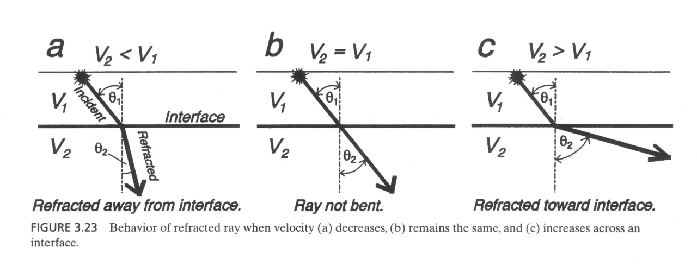

# Lecture 4
地震概论，2025 Summer
## 第三章（续）

### 地震波的折射、反射和转换

**近震情况**

P波入射时，界面上会产生反射P波、折射P波，反射转换SV波和折射转换SV波，SV波入射时与P波类似；SH波入射时只有反射SH波和折射SH波产生，没有转换波出现。因为水平面内振动的SH波不可能引起垂直面内振动的P波和SV波。

临界透射

### 地震波的走时曲线和走时方程（重要！）

**水平层状介质**

**震源在地表**

走时方程：$T-X$ 关系

- 直达波的走时方程 $T=X/V_1$
- 反射波的走时方程

$$
T(X)=\frac{2}{V_1}\sqrt{h^2+(X/2)^2}
$$

- 首波的走时方程

$$
T(X)=\frac{2h}{V_1\cos (\theta_c)} + \frac{X-2h\tan (\theta_c)}{V_2} \text{ for } X > X_c=2h\tan(\theta_c)
$$

**震源不在地表**

