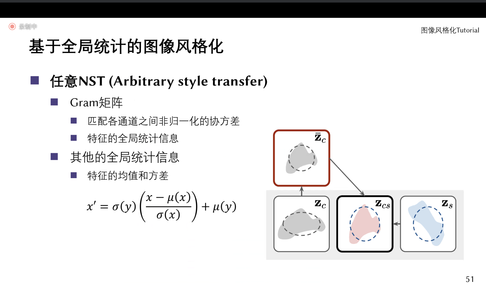

# Tutorial
March 16

## 图像风格化
杨帅

### 概念
图像风格化是指将一幅图像的风格转移到另一幅图像上，使得后者的风格与前者相似。

基于样例的图像风格

### 全局方法
将风格建模成统计特征分布

Image Style Transfer Using Convolutional Neural Networks

如何理解Gram矩阵？
* 每个卷积核对应一个视觉概念
* 边缘、纹理、语义内容

“出现黄色的地方很有可能出现圆”

如果输出图像和风格图像有相同的Gram矩阵，那么它们的风格就是相似的。

实际上用内容图作为初始图像

#### 问题
每张图都要完整的训练流程

解决：

对每个风格图像，训练前向网络f

新的问题？纹理更简单和重复；每个风格图都得训一个网络

### 局部方法
基于笔画

### 数据驱动方法
基于GAN

## Diffusion图像
### 多功能图像翻译频控扩散模型

### From DDPM to Score-based SDE

DDPM的最后一步？强行拿KL去训练一个点
$$
log p_\theta (x_1 | x_0)
$$

Yang Sone et al. NCSN

数据的稀疏性

### Score-based SDE

## 颜色恢复

