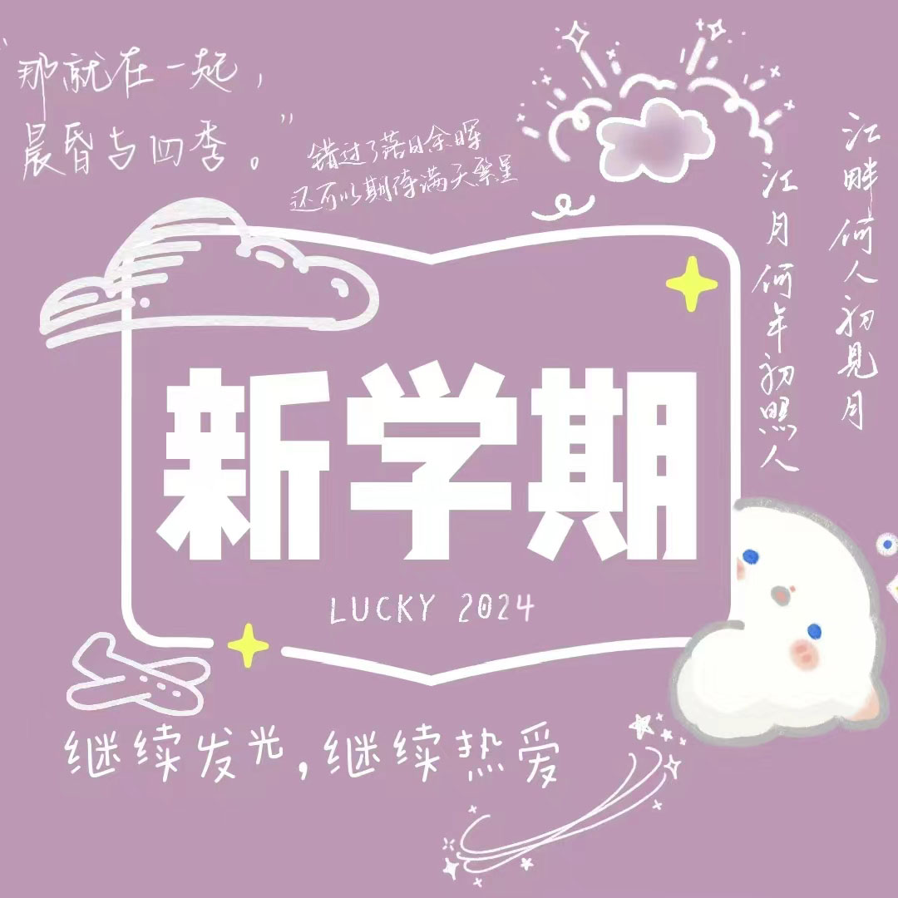
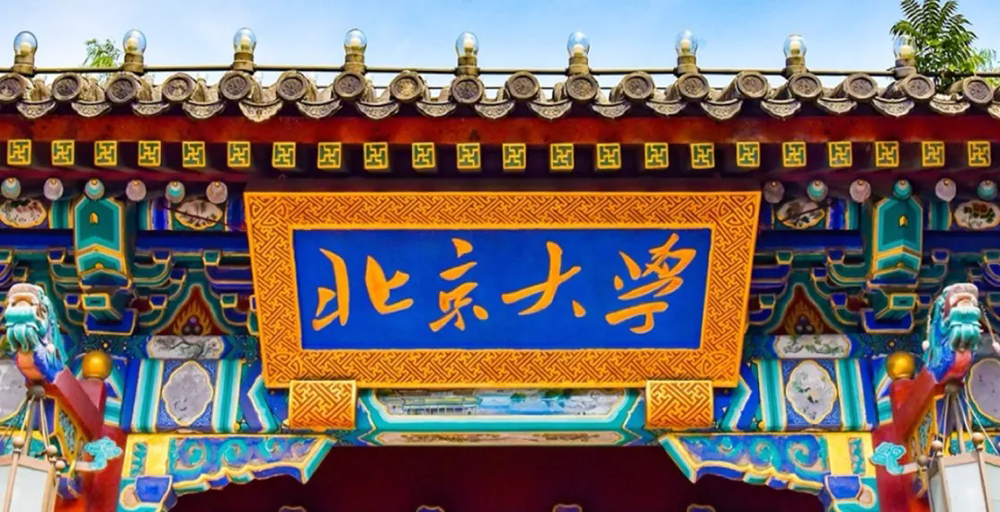

# Welcome to Calvin's world!

*This Site is still under construction. Latest update: Sep 8, 2024*

`不必害怕，因为这岛上众生喧哗。`

## 📢[ Announcements!](/public) 

### Week 3, 2024 Fall

[草鱼的24 Fa课表](/schedule/24fa-courses)

[草鱼的Current TODO List](/schedule/24fa-list)

> 四六级报考即将截止，还未报考的同学抓紧时间！

[2024-2025校历](https://calvinxiaocao.github.io/2425cal.pdf)

## [欢迎新燕！！](/welcome)

[一些萌新攻略](/welcome)

## 🎵 音乐推荐

## 学习篇

### [>> 大学课程资料](university_courses)

### [>> 网课资料](online_course)

### [>> 其他实用链接](links)

*注：由于版权等问题，暂不提供教材等电子版资料。更多学习资源、学习心得交流等内容，可通过邮箱等方式联系作者获取。*

## 文娱篇

过去的节日惊喜见[这里](/activity)

[吉聚燕园｜曹彧：成为暗夜中的璀璨烟花](https://mp.weixin.qq.com/s/zs2K9cgmLi-b9N5gp6V9Jg)

----
*个人邮箱：calvincao@stu.pku.edu.cn*
