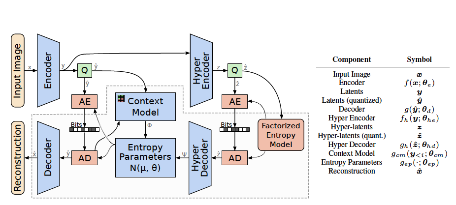

# Paper Reading: Joint Autoregressive and Hierarchical Priors for Learned Image Compression

*图像压缩系列笔记 03*

?> 这是发表在 NeurIPS 2018 上的一篇论文，承接上一篇的工作，在端到端中引入自回归上下文模型，形成延续至今的端到端基本框架。最终评估结果超过了 BPG，取得了 state-of-the-art 的效果。

## Introduction
前序知识见上一篇笔记。这篇文章做的扩展有两个：一个是将 GSM (Gaussian Scale Mixture) 扩展成 GMM (Gaussian mixture model)，另一个是加入 autoregressive 自回归。剩下的框架均和上篇文章一样。

## Architecture Details

下面是模型的核心架构。

改动的就一个公式：

$$
p_{\bm{\hat y}}(\bm{\hat y} \mid \bm{\hat z}, \bm \theta_{hd}, \bm \theta_{cm}, \bm \theta_{ep}) = \prod_i \Bigl( \mathcal N\bigl(\mu_i, \sigma_i^2\bigr) \ast \mathcal U\bigl(-\tfrac 1 2, \tfrac 1 2\bigr) \Bigr)(\hat y_i) 
$$

$$
\text{with } \mu_i, \sigma_i = g_{ep}(\bm \psi, \bm \phi_i; \bm \theta_{ep}), \bm \psi = g_{h}(\bm{\hat z}; \bm \theta_{hd}), \text{and } \bm \phi_i = g_{cm}(\bm{\hat y}_{<i}; \bm \theta_{cm})
$$

其中的自回归组件，是通过一层 Mask Convolution 实现的。通过对卷积核进行 Mask 操作，掩盖了未解码点的数值，保证了自回归模型预测的当前的像素点参数仅来自于前面已经解码的点，而不取决于未解码点。

损失函数和上文的损失函数是一样的。

## Analysis
下面截取一段来自 csdn 的分析。

自回归模型和超先验模型可以进行有效的互补工作。首先，从超优先级的角度出发，我们看到对于相同的超先验网络体系结构，对熵模型的改进需要更多的辅助信息。辅助信息会增加压缩文件的总大小，从而限制了其优势。相反，将自回归分量引入先验不会引起潜在的速率损失，因为预测仅基于因果关系，即基于已经被解码的潜像。同样，从自回归模型的角度来看，我们期望一些无法完全从因果关系中消除的不确定性。但是，超先验网络可以“展望未来”，因为它是压缩比特流的一部分，并且被解码器完全了解。因此，超级优先级可以学会存储减少自回归模型中的不确定性所需的信息，同时避免存储可以从上下文中准确预测的信息。

通过使用自回归模型与未使用自回归模型的结构冗余捕获可以看出，下图中，归一化后（第五张图）单超先验模型依旧存在一定的结构冗余，而联合优化自回归模型的归一化图的分布更接近与标准正太分布。

## Code
代码可参考 CompressAI Python 库的实现。
